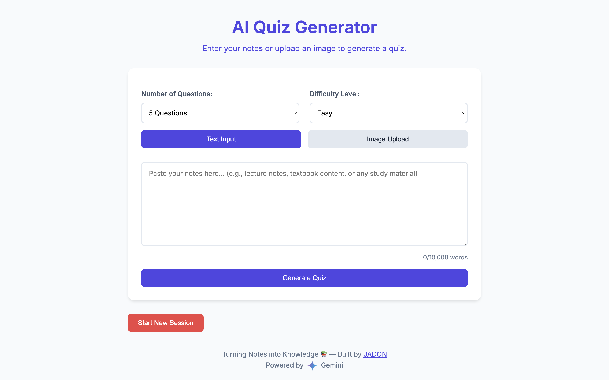
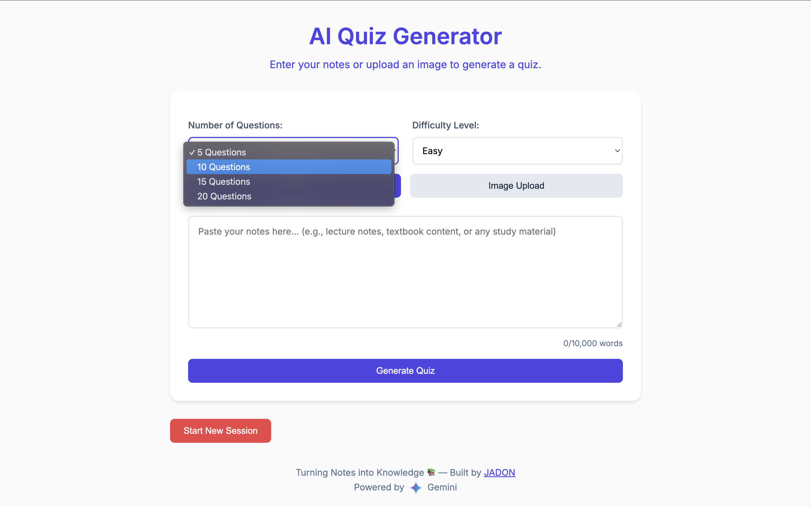
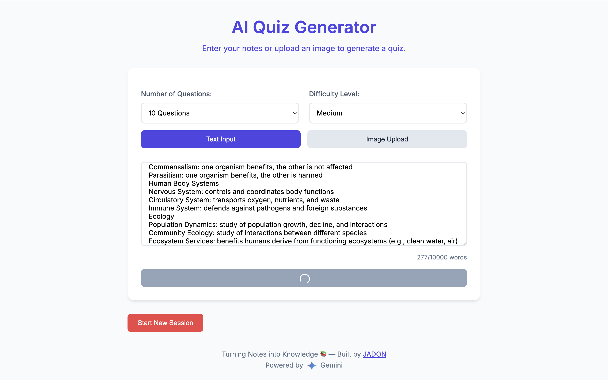
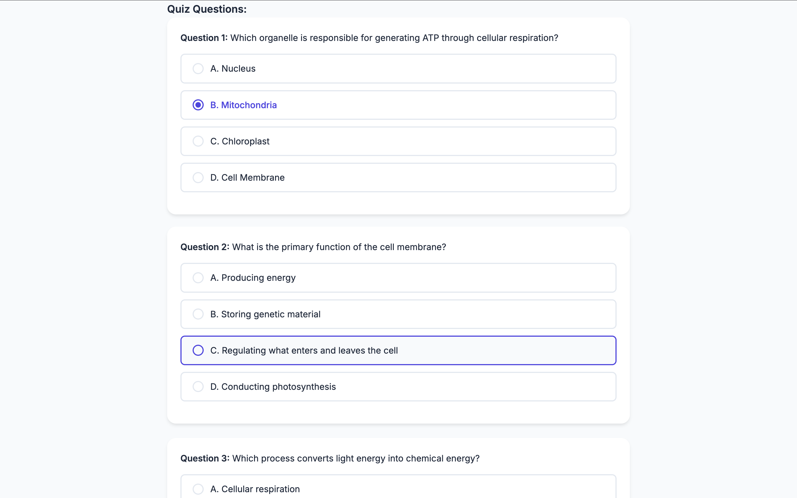
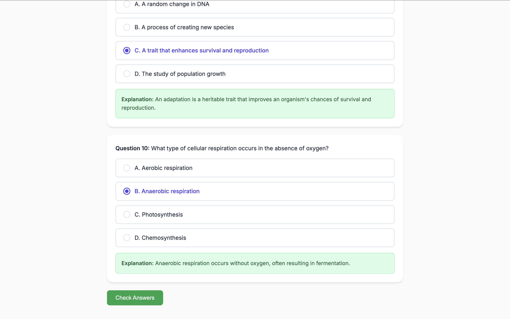

# 📚 AI Quiz Generator

Transform your **notes or images** into interactive multiple-choice quizzes using the power of **Gemini AI**. Whether you're a student preparing for exams, a teacher creating assessments, or just someone who wants to reinforce learning, this tool makes studying easier and smarter.

---

## ✨ Features

- 📝 Generate quizzes from typed **text input** (lecture notes, textbook content, etc.)
- 🖼️ Upload an **image** and convert it into quiz questions using OCR + AI
- 🎯 Customize:
  - Number of questions (5, 10, 15, or 20)
  - Difficulty level (Easy / Medium / Hard)
- ✅ Check your answers and get detailed **explanations**
- 📱 Mobile-responsive, clean modern UI built with **Bootstrap 5**
- ⚡ Powered by **Gemini 1.5 Flash**

---

## 🖼️ Screenshots


### Homepage


### Select Settings


### Text Input


### Quiz Output


### Check Answers


---

## 🔧 Setup Instructions

### 1. Clone the repository
```bash
git clone https://github.com/jadonsamuel08/ai-quiz-generator.git
cd ai-quiz-generator
```

### 2. Create a virtual environment
```bash
python3 -m venv venv
source venv/bin/activate  # On Windows use: venv\Scripts\activate
```

### 3. Install dependencies
```bash
pip install -r requirements.txt
```

### 4. Set your Gemini API Key  
> You'll need access to the [Google Generative AI API](https://ai.google.dev/).

**macOS/Linux**
```bash
export GEMINI_API_KEY="your_api_key_here"
```

**Windows (CMD)**
```cmd
set GEMINI_API_KEY=your_api_key_here
```

### 5. Run the app
```bash
python app.py
```

Then visit `http://localhost:8080` in your browser.

---

## 🧠 Why I Built This

As a high school student passionate about computer science and machine learning, I wanted to build something **practical** and **helpful** for other students like me. This project showcases how AI can make learning interactive and personalized — turning boring notes into active recall practice with just a click.

---

## 📁 File Structure Overview

```
├── app.py               # Flask app entry point
├── quiz_ai.py           # Handles Gemini-based quiz generation
├── templates/
│   └── index.html       # Main web interface (with Jinja2 templating)
├── static/
│   └── gemini-logo.png  # Gemini logo used in the footer
├── requirements.txt     # Python dependencies
└── README.md            # You’re reading it!
```

---

## 🧠 How It Works

- When you submit notes or upload an image, the Flask app routes the input to `quiz_ai.py`.
- That file calls the **Gemini 1.5 Flash API** with a carefully structured prompt.
- The AI returns multiple-choice questions (MCQs) as JSON.
- The frontend dynamically displays those questions and allows answer checking, styled with Bootstrap.

---

## 📄 Gemini Prompt Format

```python
prompt = f"""
Create EXACTLY {question_count} multiple choice questions...
Each question must have:
- question
- options (4 answers)
- correct_answer (index 0–3)
- explanation
"""
```

---

## 🤝 Contributing

If you'd like to improve this app, feel free to fork it and submit a pull request. Ideas welcome!

---

## 🛠️ Future Improvements

- Add support for **PDFs** and **slides**
- Option to **save quiz history**
- User authentication (login system)
- Export quizzes as printable PDFs or JSON

---

## 📃 License

This project is open-source under the **MIT License**.

---

## 🙌 Acknowledgments

- [Google Gemini](https://ai.google.dev/)
- [Bootstrap](https://getbootstrap.com/)
- [Pillow](https://python-pillow.org/)
- My passion for making study tools more effective ✨
